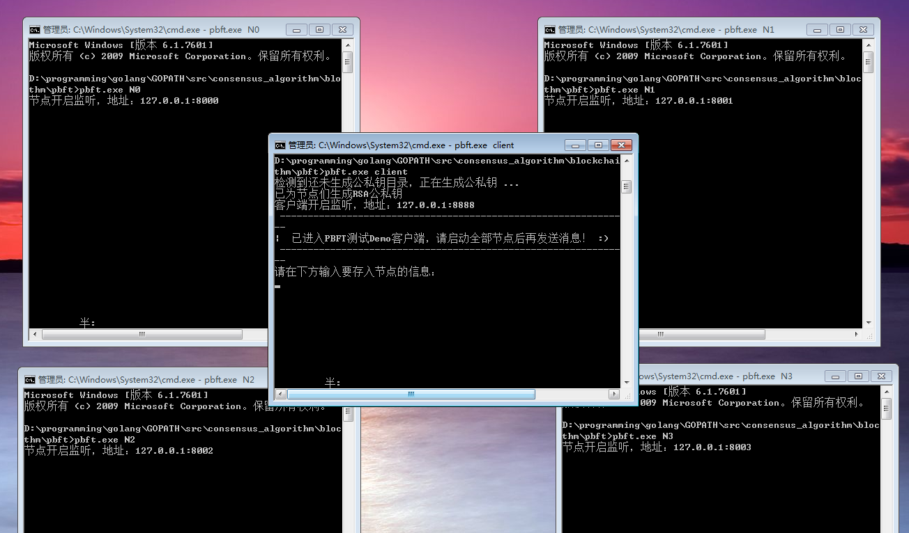
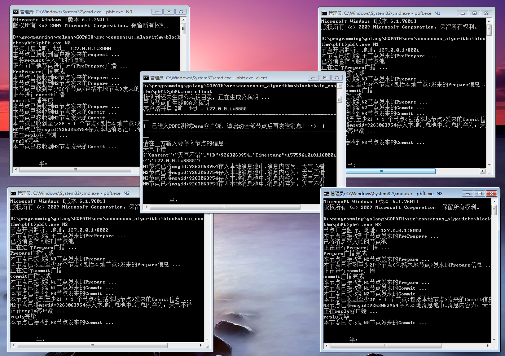
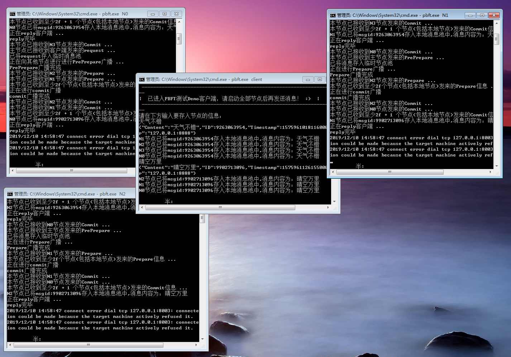
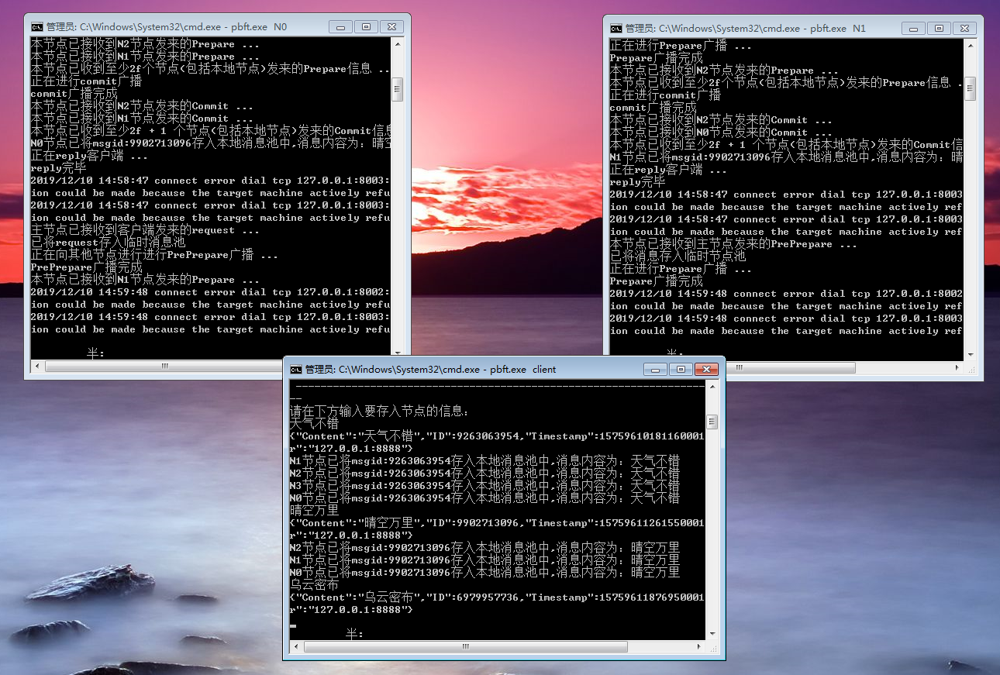

>参考资料：
> - https://www.jianshu.com/p/fb5edf031afd
> -  https://www.cnblogs.com/gexin/p/10242161.html

<br>

源码地址：[https://github.com/corgi-kx/blockchain_consensus_algorithm/tree/master/pbft](https://github.com/corgi-kx/blockchain_consensus_algorithm/tree/master/pbft)

本demo为pbft共识算法的代码实现，如果想了解pbft的详细信息请自行浏览参考资料\
本demo展示了pbft的部分功能（没有写主节点轮循机制），写的并不严谨，仅作为对pbft的了解用途


<br>


## 实现功能：
>pbft公式：  n>=3f + 1  其中n为全网总节点数量，f为最多允许的作恶、故障节点


  数据从客户端输入，到接收到节点们的回复共分为5步
  
 1. 客户端向主节点发送请求信息
 2. 主节点N0接收到客户端请求后将请求数据里的主要信息提出，并向其余节点进行preprepare发送
 3. 从节点们接收到来自主节点的preprepare，首先利用主节点的公钥进行签名认证，其次将消息进行散列（消息摘要，以便缩小信息在网络中的传输大小）后，向其他节点广播prepare
 4. 节点接收到2f个prepare信息（包含自己）,并全部签名验证通过，则可以进行到commit步骤，向全网其他节点广播commit
 5. 节点接收到2f+1个commit信息（包含自己），并全部签名验证通过，则可以把消息存入到本地，并向客户端返回reply消息

<br>


## 运行步骤：
<br>

##### 1.下载/编译
```shell
 git clone https://github.com/corgi-kx/blockchain_consensus_algorithm.git
```
```shell
 cd blockchain_consensus_algorithm/pbft
```
```go
 go build -o pbft.exe
```

##### 2.开启五个端口（一个客户端，四个节点）
客户端执行pbft.exe client  
其他四个节点依次执行 pbft.exe N0  pbft.exe N1  pbft.exe N2  pbft.exe N3

##### 3.输入一段信息，看看节点之间的同步过程

##### 4.关闭一个节点（代表作恶、故障节点），再次输入信息，看看是否还会接收到reply
可以看到，客户端依然会接收到reply，因为根据公式 n >= 3f+1  ，就算宕机一个节点，系统依然能顺利运行

##### 4.关闭两个节点（代表作恶、故障节点），再次输入信息，看看是否还会接收到reply
可以看到，关闭两个节点后，故障节点已经超出了pbft的允许数量，消息进行到Prepare阶段由于接收不到满足数量的信息，固系统不再进行commit确认,客户端也接收不到reply


>**&ensp;&ensp;&ensp;建了个QQ群：722124200     有问题可以加群互相讨论   ：）** \
>**&ensp;&ensp;&ensp;邮箱:mikesen1994@gmail.com  &ensp;&ensp;&ensp; vx:965952482**